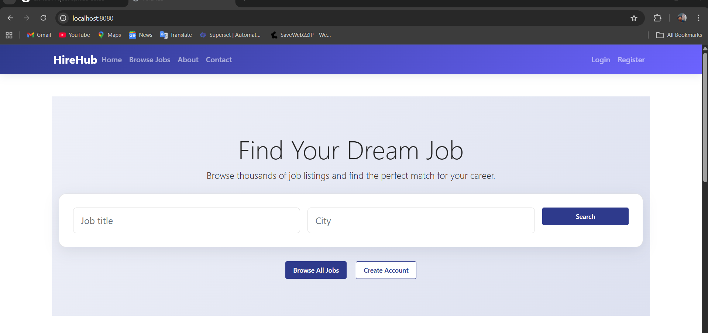
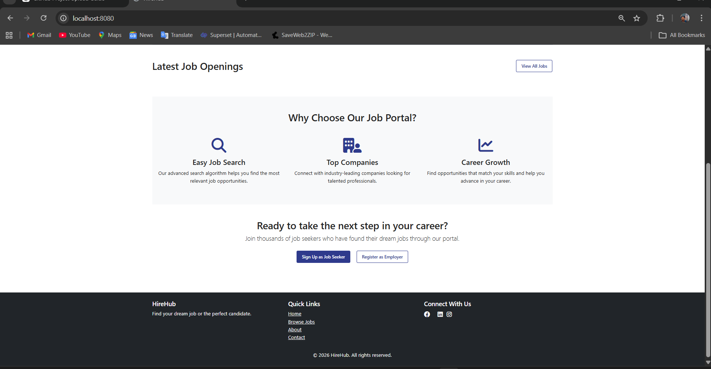
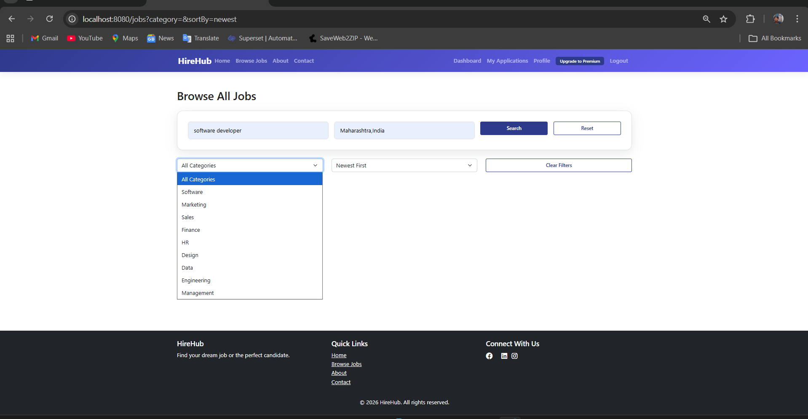
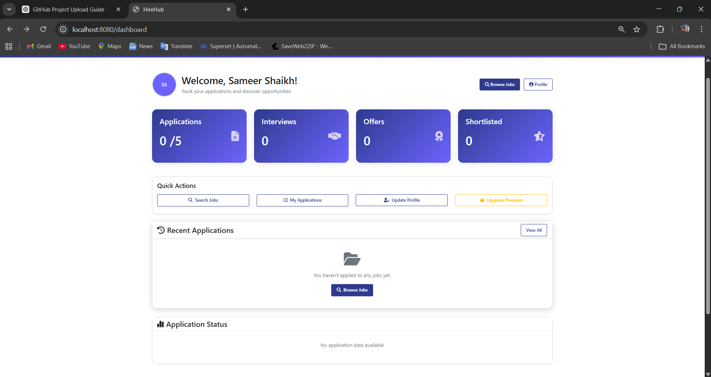
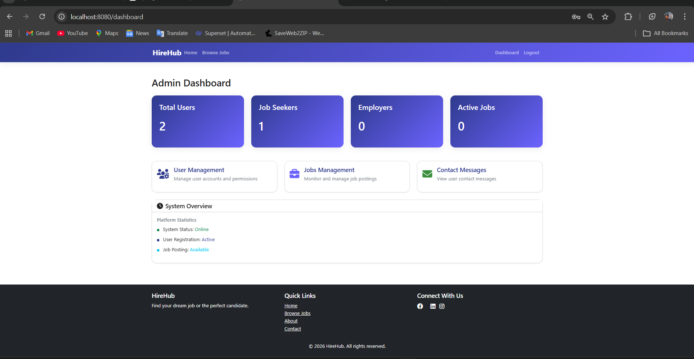

# 💼 HireHub Job Portal System

A full-stack Job Portal web application built using Spring Boot that enables job seekers to search and apply for jobs, and employers to manage job listings with role-based access control.

---

## 🚀 Key Features

✔ Job Search, Filter & Sorting  
✔ Category-Based Job Browsing  
✔ Resume Upload & Job Application  
✔ Employer Job Posting & Management  
✔ Application Tracking System  
✔ Role-Based Access Control (Admin, Employer, Job Seeker)  
✔ Session-Based Authentication  
✔ Admin Moderation & Monitoring Console  
✔ Payment Integration for Premium Features  

---

## 🔐 Security Implementation

- Spring Security integration  
- Role-based access control (RBAC)  
- Session-based login system  
- Secure authentication layers  

---

## 🛠 Tech Stack

- Java  
- Spring Boot  
- Spring Security  
- Thymeleaf  
- Hibernate / JPA  
- MySQL  
- HTML, CSS, JavaScript  

---

## 🗄 Database Design

Entities Used:

- User  
- Job  
- Category  
- Application  
- Resume  

---

## ⚙ How to Run the Project

1. Clone the repository  
2. Configure MySQL database in `application.properties`  
3. Run the Spring Boot application  
4. Open in browser: http://localhost:8080  

---

## 🖼 Screenshots

### 🏠 Home Page

### 🔍 Job Listings

### 📄 Job Details

### 📤 Apply Job

### ⚙ Admin Dashboard

---

## 📌 Project Highlights

- Built a scalable job portal with multi-role architecture  
- Implemented secure authentication and session management  
- Designed efficient job filtering and application tracking system  
- Integrated payment features for premium job listings  

---

## 📫 Contact

👤 Sameer Shaikh  
📧 sameer.shaikh.052373@gmail.com  
